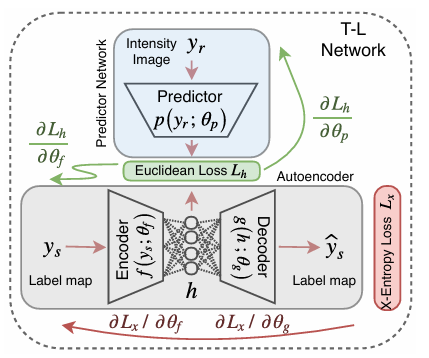
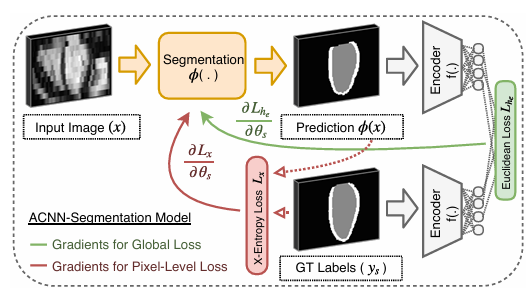
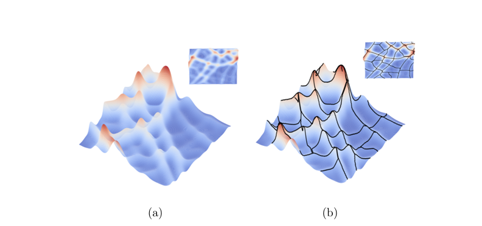

<h2>Research about loss topology functions</h2>

<h3>A Topological Loss Function for Deep-Learning based Image Segmentation using Persistent Homology (Clough 2020) </h3>

This paper develops a topology loss function based on persistent homology. It allows us to bring our assumptions about the topology into the loss function by defining the expecte number of topological features.

<b>Topology-Loss Function</b>: As mentioned before, it uses persistent homology, i.e. the betti number 0 and betti number 1 for the 2d case.
Notations: we express the pixels of the image by elementary cues. The pixel at row i and column j can then be denoted as $Q_{ij} = [i, i+1] \times [j, j+1]$.
Let $B(p)$ be the set containing all elementary cubes for which the predicted segmenation value is larger than threshold p.
Persistent homology counts the number of topological features of different dimensions in B(p) at each value of p. In the case of 2D only betti number 0 ($\beta_0$) and betti number 1 ($\beta_1$) are relevant. For any feature in any dimension, we compute the birth and death threshold values. The birth value is the largest threshold value for which the feature exists, the death value the smallest threshold value where the feature exists. The birth and death values of the l-th feature of dimension d are written as $b_{k,l}$ and $d_{k,l}$. Further the actual number of features in dimension d is noted as $\beta_k^*$. This value must be known in order to compute the loss. For example for the digit 0 in digit segementation one could assume $\beta_0^* = 1, \beta_1^*=1$.
Finally the topology loss is defined as:

$$\mathcal{L}_k(\beta_k^*)= \sum_{l=1}^{\beta_k^*} (1 - |b_{k,l} - d_{k,l}|^2) + \sum_{l=\beta_k^*}^\infty |b_{k,l} - d_{k,l}|^2$$

$$\mathcal{L}_{\text{topo}} = \sum_{k} \mathcal{L}_k(\beta_k^*)$$

This loss function is minimised when the barcode diagram
has exactly $\beta_k^*$ bars of length 1 (birth - death = 1), for each k and no other bars. The second term punishes the model if it findes too many features, especially if it is very sure about those features (large range).

<b> Pipeline/Model </b>
Uses an underlying UNet. In a first step a labeled dataset is used to train the Unet with a MSE or a Dice Loss. Then in a second step an unlabeled dataset (no ground truth mask, but $\beta_k^*$ are known.), the topo loss is used in a combination with the dice loss to further improve the model weights.

<b> Uncertainties/Questions </b>
- How is the case handled when less than $\beta_k^*$ features were found by the model?
- how are the birth and death values computed? Approximation?

<b> Suitability to DifSeg </b>
- would need an assumption about the number of features for the connected components and the number of circles.
- mutliclass implementation: could be treated as having multiple binary segmentations

<h3> Beyond the Pixel-Wise Loss for Topology-Aware Delineation (Mosinska 2017)</h3>
<!--
This approach does not directly introduce a new topology loss function. It exploits pretrained  -->

<b> Topology Loss Function </b>
The approach leverages the knowledge that pretrained network contains about the structures of real-world images. The higher-level features of pretrained image networks like VCG should encode the topological structures. The ground truth mask and the prediction mask should therefore be passed through such a pretrained image network, so that a new penalty term can be used to minimize the difference between descriptors of ground truth images and the corresponding predicted ones.
An aggregate MSE-Loss over multiple layers and maps is used:

$$\mathcal{L}_{\text{top}}(x,y,w) = \sum_{n=1}^N \sum_{m=1}^{M_n} \| l^m_n(y) - l^m_n(f(x,w)) \|^2_2 $$

Here x is the actual image and y the ground truth mask. Further $l_m^n$ denotes the m-th feature map in the n-th layer of the pretrained network (VGG19). $N$ is the number of convo lutional layers considered and $M_n$ is the number of channels in the n-th feature map.

The loss function is then combined with the BCE-loss and used in this form for the training of a fully convolutional U-Net.

<b> Refinement Process </b>
The paper further presents an iterative refinement process. The fully convolutional U-net $f$ is applied multiple times and accepts a concatenated input of the actual image and the segmentation prediction from the previous iteration. It is based on the assumption that feeding in the correct segmentation (ground truth $y$) will return the input, i.e.:
$$ y = f(x \oplus y)$$
The process is then $K$ times repeated:

$$\hat{y}^{k+1} = f(x \oplus \hat{y}^{k}) \quad \text{for} k=0, ..., K-1$$

We start with a completely black segmentation mask $\hat{y}^{0}$ at the start.
We further use a partial loss, meaning that after every iteration the presented loss from above will be applied. However, the later layers are weighted more then the first ones.

<b>Advantage</b>: No topology assumptions need to be made. It can be applied to any kind of segmentation problem without knowing anything about the topology of the segmentation.

<b>Uncertainties/Questions</b>
- the paper motivates the approach for the detection of linear structures. As we do not have linear structures it is unclear how well the this approach will perform on our problem.
- Liposchwitz-Continous ?

<b> Suitability to DifSeg </b>
- Binary Segmentation so far. Would need to be adapted to for multiclass segmentation. $\rightarrow$ Applying pretrained network for every class and aggregating the loss over the classes.

- see first point in uncertainties

<h3>Anatomically constrained neural networks (ACNNs) (Oktay) </h3>

The approach is very similar to the paper before (Beyond the Pixel-Wise Loss for Topology-Aware Delineation from Mosinska). Unlike Mosinska, it does not use a pretrained image encoder like VGG, but trains its own autoencoder on the ground truth segmentation mask. It only uses the encoded representation for the MSE loss computation and not an aggregation of the first $N$ convolution layers of the encoder. For the AE the paper applies a T-L model (Learning a Predictable and Generative
 Vector Representation for Objects) consisting of two components, an Autoencoder for the segmentation maps and a predictor for hte original images. The goal of the T-L model is to minimize the euclidean distance of the encoded image representation and the encoded representation of the corresponding segmentation map.

 The encoder part of the AE does then execute the Job of the VGG19 Model in Monsinska et al..

 

 Note: the trained predictor of the TL-model could also be used to train the acnn-superresolution model, which can be used as a preprocessing module for the segmentation of get a better a resolution of the original images.

<b>Results</b>
Use ACDC dataset, but only for some ablation study.
On the other dataset they achieve better dice score and better hausdorff distance than the state of the art models at that time. They compared their results to models like 2D-FCN, 3D-Unet, AE-Seg and BEAS.

<h3>TopoDiffusionNet: A topology-aware diffusion model (Gupta 2024)</h3>

Applies similar principles as Cloud et al. (2020), as it expresses the topology either through the number of connected componenets (betti nr. 0) or the number of holes/loops (betti nr. 1). However, unlike Cloud it only considers one of the numbers at the same time, meaning a model is either trained using betti nr. 0 or betti nr. 1 for the loss but not both.

<b>Topology Loss Function</b>
The loss function is very similar to the one in Cloud's work:

$$\mathcal{L}_{top} = - \sum_{p \in \mathcal{P}} |b_{p} - d_{p}|^2 + \sum_{p \in \mathcal{Q}} |b_{p} - d_{p}|^2$$

where $\mathcal{P}$ contains the $c$ topological features with the highest persistance (highest difference between birth and death).
The difference to Cloud is that it only considers one dimension (either 0 and 1) and that it takes the negative persistance of the features with the highest persistance instead of computing 1 minus the persistance.

<b> Results </b>
Only compared to the Dall-E 3 (text-to-image transformer) and other diffusion models. Clearly outperforms the other models in terms of accuracy, precision and F1 score. However, no classic UNet Segmentation model is used in the comparison.

<h3> Road Network Reconstruction from satellite images with Machine Learning Supported by Topological Methods (Dey, 2019) </h3>

Divided into two steps. Step 1: use a CNN for normal road segmentation. Step 2: extract the hidden road-network graph from the segmented images. The road-network graph extraction is called Discrete-morse based graph reconstruction.

<b> Discrete-morse based graph reconstruction </b>
Assume we have a triangulation K of the image (not sure why a triangulation is needed?). Then the segmented image can be viewed as a "density function" $f$, where the $f(s)$ denotes the probability of $s$ being a part of the road. The function can be represented as a terrain (see Figure on the left). We are now interested in the flow lines/curves that connect maxima and saddles of the terrain. These lines seperate the different valleys in our terrain. The points on these curves/lines have a higher probability than points off the curve in a direction orthogonal to the curve locally. Intuitively, this is how roads should be: pixels belonging to the road should have higher probability than the ones of the road. Hence, the interpretation is that these curves correspond to our roads.

 

An algorithm called MorseGraphRecon (Graph Reconstruction by Discrete Morse Theory by Dey et al.) extracts these curves from the segmentation image taking $\mathcal{O}(n \log n)$ for the planar triangulation with $n$ vertices.

<h3> Learning Topological Interactions for Multi-Class Medical Image Segmentation </h3>
TODO

<h3>Other papers</h3>

- <b> Persistent homology for fast tumor segmentation in whole slide histology images (Qaiser) </b>
  Not really a new concept. Also exploits persistent homology. However, it also includes the betti number 2.

- <b> Topological persistence based on pixels for object segmentation in biomedical images (Assaf) </b>
- <b> Segmenting the papillary muscles and the trabeculae from high resolution cardiac CT through restoration of topological handles (Gao) </b>

gudhi library
betti-matching 3D

toplayer (python package)
union find algo by edelsbrunner & harer
