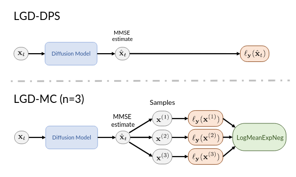
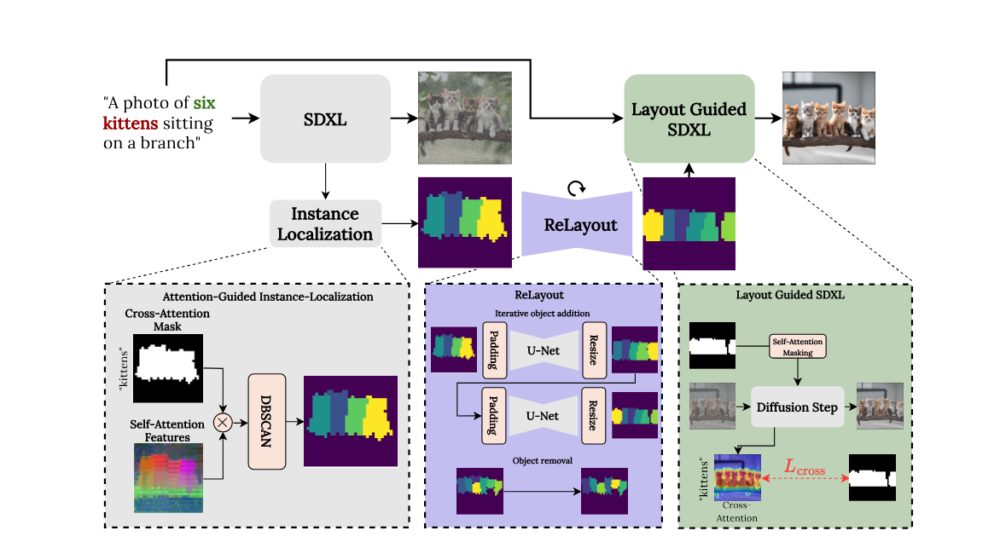

<h2>Papers</h2>

<h3>Denoising Diffusions in Latent Space for Medical Image Segmentation (LDSeg)</h3>

Two parts:
- Mask autoencoder: Operates on the true mask. It learns a uni-variate low-dimensional Gaussian representation of the mask using a simple Res-Unet shaped autoencoder without skip-connections. m_0 = enc(M) is the latent representation, where M is the original mask and M' = dec($m_0$) is the reconstructed mask. For training, the (multi-class) cross entropy loss is used.
Reasons for this method: Segmentation masks have only a few discrete values (modes), corresponding to different classes. Training a denoiser would mean injecting gaussian noise which is unnatural as the values are structured and discrete. Uni-variate gaussians were chosen as it simplifies training over multivariate. 
- Conditional Denoiser: A classic Diffusion Model. It uses a concatenated two channel input consisting of the latent representation generated by the Mask autoencoder and a image embedding produced by an Image Encoder. At timestep t in the forward phase, gaussian noise $m_t$ is generated for timestep t given $m_0$ and noise variance schedule parameters $\alpha$, $\beta$. Denoiser has a standard UNet shape. Objective is to learn the transitional latent state distributions
$d_{\theta} (m_{t−1}|m_t, I, t)$ where $I$ is the source image.

Reverse Process: Note that the denoiser is independent of image encoder, so we won't need the image encoder in the reverse process. We start with $\tilde{m}_T \sim \mathcal{N}(0, \text{I})$ and then repeatedly computing $\tilde{m}_{t-1}$ using $\tilde{m}_{t}$ until $\tilde{m}_{0}$. Then use the decoder from the mask autoencoder to get the segmentation: dec($\tilde{m}_{0}$). 

Results:
As the diffusion happens in the latent low-dimensional space, the total sampling time will be smaller than with other diffusion models. The paper also observed that with very few sampling steps ($\leq$ 15),  maximum segmentation accuracy can be achieved. 
It is also more robust to noisy images. The intuitive explanaition is that the denoiser in LDSeg is conditioned on image embedding, which is a low-
dimensional representation of the source image. Low-dim representation are normally more robust to high frequency noise.

<h3> Loss Guided Diffusion Models (by Song et al.) </h3>

<b>Score Function</b>: Let $p(x)$ be a density function, then $\nabla_x \log p(x)$ is the (stein) score function. Mathematically, it preserve all information from the density function, but it is easier to work with computationally. Score function does not need to be normalized --> allows for more flexible models as we can bypass the normalization constant. Allows controllable generation. 

<b>Idea</b>: Let y refers to conditioning information/observation. The goal of Loss-Guided Sampling is to incorporate external control or guidance into the diffusion process through a differentiable loss function $L(x_t,y)$. If we want to sample $x_0$ in the reverse diffusion process we want to guide the sample $x_t$ at every step t using the gradient of the loss function with respect to $x_t$ and $y$. 
<!-- $$\nabla_{x_t} \log p(x_t | y) \propto - \nabla_{x_t} L(x_t, y)$$

The sampling equation would then be
$$x_{t-1} = x_t + \gamma \nabla_{x_t} \log p(x_t | y) + \epsilon $$
where $\gamma$ is the stepsize and $\epsilon$ gaussian noise. Thanks to the gradient term, the $x_t$ will be guided towards a region of samples that minimizes the loss $L(x_t, y)$. 
Via bias rule we get 
$$\nabla_{x_t} \log p(x_t | y) = \nabla_{x_t} \log p(y | x_t) + \nabla_{x_t} \log p(x_t)$$

So in order to do our reverse process we need to computed $ \nabla_{x_t} \log p(y | x_t)$ at every timestep t. 

<b>The problem of Loss-Guided Diffusion:</b> Given a diffusion model $D_\Theta$ and a loss function $l_y(x_0)$ defined only for noiseless data $x_0$, estimate the loss guidance term $\nabla_{x_t} \log p(y | x_t)$ for all $t \in (0, T]$. Notice that the paper also uses the notation $\nabla_{x_t} \log p^{(l)}(y | x_t)$. 

However, $\nabla_{x_t} \log p(y | x_t)$ is generally untractable. Need to work with approximations:
- DPS: $\nabla_{x_t} \log p(x_t | y) = DPS(x_t, y) := \nabla_{x_t} \log p(\hat{x}_t | y)$, where $\hat{x}_t$ is MMSE estimator of $x_0$ given $x_t, \sigma_t$, i.e. the element that minimizes
$$L_t(\Theta) = \mathbb{E}_{x_0, x_t}[\| D_\Theta(x_t, t) - x_0 \|^2_2]$$ -->

Given a diffusion model $D_\Theta$ and a loss function $l_y$ we would like to sample $x_0$ while considering some condition $y$ expressed through the loss function $l_y$.
We do this by sampling from 
$$p_0^{(l)}(x_0 | y) = p_0(x_0)\exp(-l_y(x_0)) / Z$$
where Z is the normalization constant. To better leverage existing efficient
samplers for diffusion models, we wish to derive guidance terms for different noise levels $t \in (0, T ]$ given the loss function $l_y(x_0)$, which is defined only for clean data $x_0$.
We therefore define $x_t \sim p_t^{(l)} (x_t|y)$ by the the following process:
$$x_t = x_0 + \sigma_t \epsilon$$
where $x_0$ is sampled from $p_0^{(l)}(x_0 | y)$ and $\epsilon$ some gaussian noise. 

In order to draw samples from $p_0^{(l)}(x_0 | y)$ using a diffusion model, we need the "loss guidance term" 
$$\nabla_{x_t} \log p^{(l)}(y | x_t) = \nabla_{x_t} \log (p^{(l)}(x_t | y) / p^{(l)}(x_t))$$
The problem is that this term is intractable as we have to integrate over $x_0$.
$$\nabla_{x_t} \log p^{(l)}(y | x_t) = \int_{x_0} p(x_0 | x_t) p_0^{(l)} (y | x_0) dx_0$$
As a consequence we have to work with an approximation. Such an existing approximation is DPS by Chung et al. (2022). The paper suggests another new strategy relying on Monte Carlo. It computes the approximation using n samples:
$$MC_n(x_t, y) = \nabla_{x_t} \log \left(1/n \sum_{i=1}^n \exp(-l_y(x^{(i)})) \right)$$
The samples $x^{(i)}$ are sampled from an approximate inference distribution $q(x_0|x_t)$ which is ideally close to the true $p(x_0|x_t)$. The paper considers here $q(x_0 | x_t) = \mathcal{N}(\hat{x}_t, r^2_tI)$. $r_t$ is a hyperparameter and $\hat{x}$ is the MMSE estimate. IMPORTANT: This is not a highly accurate estimate, but a viable option given that we can only affo CoCoCount rd a single evaluation of
the diffusion model. 

<b> MSEE estimate: </b> Marks the element that minimizes
$$L_t(\Theta) = \mathbb{E}_{x_0, x_t}[\| D_\Theta(x_t, t) - x_0 \|^2_2]$$
Where $D_\Theta$ is a time-conditioned neural network that tries to denoise $x_t$. Assuming infinite capacity of the network, the estimate is related to the score function via Tweedie's Formula: 
$$\hat{x}_t := D_\Theta(x_t, t) = x_t + \sigma_t^2 \nabla_{x_t} \log p_t(x_t)$$ 

<h3> Make it Count by Binyamin et al. (2024) </h3>

<b> SDXL </b>: A latent diffusion model used for text-to image synthesis.

The paper presents an approach to more accurately generate  an image with the correct number of objects according to some prompt (i.e. "A photo of 4 cats"). Diffusion models often fail to control the number of depicted objects.
The approach of the paper first applies 500 timesteps of the SDXL. It then uses a two-step process consisting of <b> Instance Localization </b> and <b> ReLayout </b>. 

- <b> Instance Localization </b>: Apply cross-attention between the image produced by the SDXL and the object(s) (i.e. "cats") and generate a cross-attention mask. Use the embedding of the text token to calcuate the query and the image for the keys and values. This approach follows the paper "Prompt-to-
prompt image editing with cross-attention control" by Hertz. In a second step, it analyzed the underlying model of SDXL which is a UNet. The authors were interested if and how well the model encodes information about object instances at its layers. They tested self-attention features of various layers using their PCA visualization  found out that at the layer $l^{up}_{52}$ at timestep 500, the distinction is best, as the different object were having different colors. (Only little research was done, not sure how well this observation generalizes). Finally, the self-attention features from layer $l^{up}_{52}$ and the cross-attention mask were combined and the clustering algorithm DBSCAN was used to produce the output image of this step. 

- <b> ReLayout </b>: The ReLayout step takes the output of the Instance Localization as input.  This step should correct the number of objects, if the SDXL-image has currently less objects than the prompt asks for, then it iteratively adds objects, if it has too many, it iteratively removes them. For this iteration process a UNet is used, which is specifically trained on a dataset consisting of pairs of images $I_k$ and $I_{k+1}$, where the two images only differ by one in the number of objects. 
From these images, binary masks are produced for each object. The binary masks are then used as input channels. It supports up to 9 different objects/input channels. The number of output-channels is 10 allowing for adding up to 10 objects. Further, padding is used in order to "zoom-out" if many objects need to be added. 

Datasets used: T2I-Compbench-Count and CoCoCount (their own).
Compared with 6 baselines: SDXL, DALL-E3, ...
 --> higher accuracy in getting the correct number of objects in the foreground than any other method on both datasets.  

<!-- Dear Prof. Wattenhofer

Sorry for my late response, I spent some time on vacation, before starting with the thesis. 
First of all, thank you for formally supervising my thesis. You won't have to supervise for content, this will all be done by the Department of Quantitative Biomedicine from UZH. 
My supervisors had a question about the grading. Do you plan on grading the work as well and then take the average of your grade and the one from my supervisors or will you not participate

Hoi
Mir isch mitteilt wurde dass du nanig bim Bauer Sport gsi bisch zum de Trainer aaprobieren und de bstellzettel usfülle. S Fenster isch jetzt verlängeret wurde bis und mit de Samstig (14.9). Wenn du also en Trainer ha möchtisch bitt ich dich das i de NEGGSTE 2 TÄG na z erledige oder öper anders verbii zschicke wo für dich de bstellzettel mit de entsprechende grössene uusfüllt. Süscht gits kein Trainer!
Lg Stefan -->